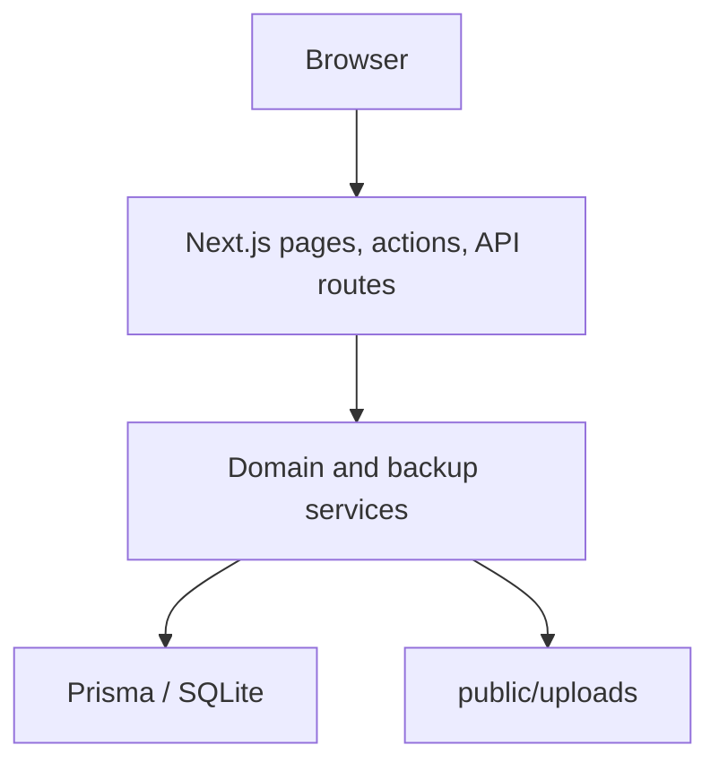

# BinVault architecture

BinVault 1.0.0-rc.2 is a local/private Next.js App Router application. Server-rendered pages and server actions call focused domain services; JSON routes support search, inventory photos, backup delivery, and health/readiness probes. Services use a global Prisma 7 client with the better-sqlite3 adapter and a local `StorageProvider` for media. SQLite lives at the configured `DATABASE_URL`; BinVault-managed files live under `public/uploads`.

The schema models hierarchical Locations, reusable Container Types and Categories, Containers, typed Inventory Items, Media, and append-only Events. Container and inventory mutation services validate relationships and safe deletion. Events commit with their associated database mutations. Media files cannot participate in a database transaction; an interrupted operation can leave orphaned files or missing-file references.

Dashboard Intelligence and search are implemented. Backup uses a consistent SQLite snapshot and stages managed media before streaming a bounded ZIP. A single-process maintenance gate coordinates application mutations; other writers are unsupported. Validation checks manifest/checksums, paths, limits, SQLite integrity, and migration compatibility. Restore is a stopped-app operator workflow with sibling staging, rollback material, and an automatic safety backup; the running Prisma client is never asked to reconnect after a file swap.

The RC supports one trusted operator and one app process. It has no authentication and must not be exposed directly to the public Internet. QR label generation/scanning, maintenance workflows, document uploads, notifications, multi-user, cloud/offline, and live restore are **future** modules. Earlier development architecture diagrams depicted a QR module and said location nesting was future; neither statement describes the current RC.
